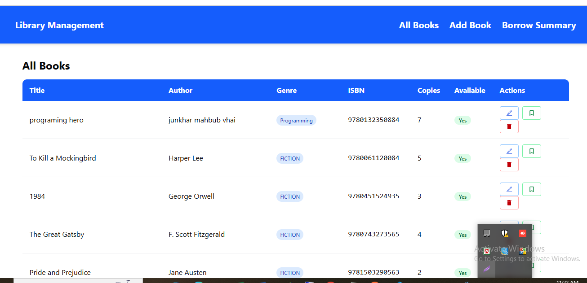

# Library Management System - Frontend



A modern React-based frontend for a library management system with book catalog, borrowing functionality, and admin features.

## Features

- 📚 Book management (CRUD operations)
- 🔍 View all books with filtering
- 📝 Add/edit book details
- 🚀 Borrow / return functionality
- 📊 Borrowing summary
- 📱 Fully responsive design

## Technologies Used

- **Frontend Framework**: React 18
- **State Management**: Redux Toolkit + RTK Query
- **Styleing**: Tailwind CSS
- **Routing**: React Router 6
- **Form Handling**: React Hook Form
- **Notification**: React Toastify
- **Date Handling** date-fns
- **Type Safety** TypeScirpt

```
npm install
npm run dev
```

## API Integration

| Endpoint | Method | Description |
| -------- | ------ | ----------- |

| /books | GET | Get all books |

| /books | POST | Add new book |

| /books/:id | PUT | Update book |

| /books/:id | DELETE | Delete book |

| /borrow/:bookId | POST | Borrow a book |

| /borrow/summary | GET | Get borrow summary |
